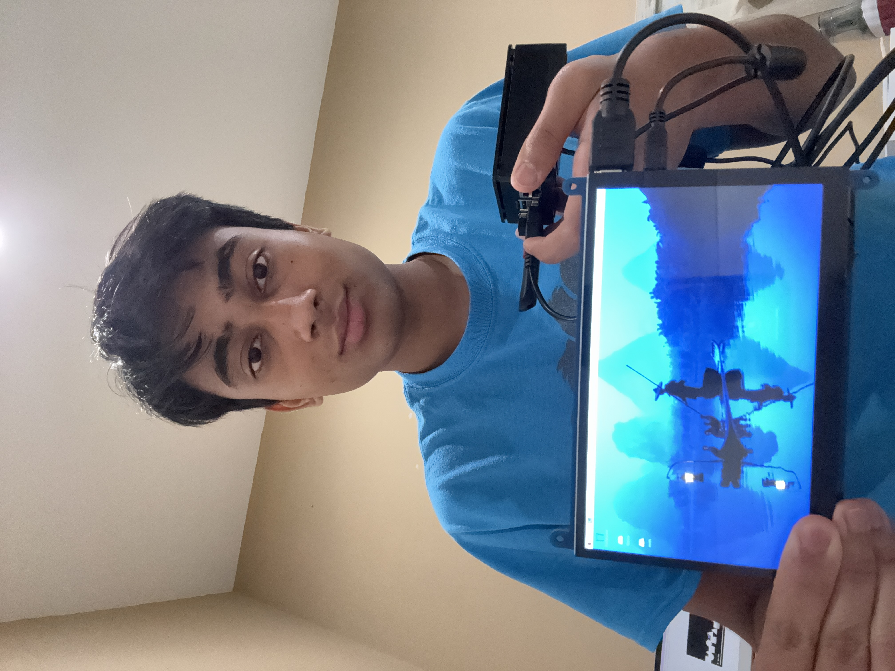

# Lunar Lander Simulation
My base project is an automated, self learning lunar lander simulation that trains itself through DQN (Deep Q Network) reinforcement learning. It operates on a reward pattern determined by variables such as fuel consumption and if it landed successfully. Through a few hundred thousand episodes, it optimizes the reward and therefore lands more efficiently, eventually being able to land properly without crashing. This process will usually take about 20 minutes for optimal results.

| **Engineer** | **School** | **Area of Interest** | **Grade** |
|:--:|:--:|:--:|:--:|
| Ritvik U | Dougherty Valley High | Computer Science + Astronomy | Incoming Senior 

**Replace the BlueStamp logo below with an image of yourself and your completed project. Follow the guide [here](https://tomcam.github.io/least-github-pages/adding-images-github-pages-site.html) if you need help.**

  
# Final Milestone

<iframe width="560" height="315" src="https://www.youtube.com/embed/F7M7imOVGug" title="YouTube video player" frameborder="0" allow="accelerometer; autoplay; clipboard-write; encrypted-media; gyroscope; picture-in-picture; web-share" allowfullscreen></iframe>

My last milestone and biggest accomplishment was allowing the user to create their own custom environment for the lander. I started with just letting the user draw a line and then tried to save that as an environment, but I later realized this was impractical, and couldn't find a way to save the line into the lander's environment. I then pivoted towards a drag and drop, where the user could choose from three preset shapes (square, circle, triangle) and move them wherever they wished so that they could create their own rugged terrain to challenge the lander. I was able to get the shapes to load without much difficulty, but the main issue was adding collision to the shapes. My first thought was to simply look at how the original program implements collision by going through the source code, but when I replicated it, there still wasn't any collision. I ended up researching and testing quite a bit on how I could make the shapes collide with the lander using the Box2d physics engine (similar to the original program), but most of them were to no avail until I decided to create separate static bodies for each shape, so that they would behave like the ground. This was fairly complicated as well, since I had to set the maskbits and categorybits to program the dynamic bodies (the lander) to collide with the static bodies (the shapes). I finally reached success with this method, and I was able to get a program that works as I had envisioned since the beginning. 

Bluestamp was a very different program than what I was used to, since it was much more hands-on and allowed the students to do much more thanks to the modification aspects. I never really felt this determined about a project before, and the challenging modification helped build my motivation to continue doing more with software. Some important topics that I was able to understand better mostly include using GitHub for saving code and that understanding the source code can really help at times. In the future, I want to work more on my web application and possibly participate in hackathons, since I found this experience to be overall very fulfilling. 

# Second Milestone

<iframe width="560" height="315" src="https://www.youtube.com/embed/y3VAmNlER5Y" title="YouTube video player" frameborder="0" allow="accelerometer; autoplay; clipboard-write; encrypted-media; gyroscope; picture-in-picture; web-share" allowfullscreen></iframe>

For my second milestone, I mostly focused on optimizing the program's speed by utilizing various methods such as overclocking the Raspberry Pi and tweaking the learning model. The first thing I did was test the base model to see how long it takes to run. However, the base model is a little different from the intented base model already, as I mentioned I had to use an external SSD drive for the Pi's OS instead of the provided SD card since the card stopped working. One important thing to note before I dive in is that the model always ran 100,000 episodes in all of these tests. Albeit, this resulted in a real time of 24 minutes and 39 seconds, which is quite a bit of time for just one program. Furthermore, the graph of the learning model didn't quite show significant improvement for the time given. My next test was to overclock the Pi itself to support voltage of 6V, as well has having a max CPU frequency of 1800 MHz. I also made sure to test it for any overheating before going through and executing the program. This new and improved Pi was able to execute in 24 minutes and 12 seconds, which wasn't much of an increase in efficiency. For reference, the un-modified version of the Pi runs at 1500 MHz CPU and 500 MHz GPU, with a 5V power. When looking at the difference, there isn't really much, and some features can get bottlenecked. Therefore, this didn't really have much of an impact. 

The next thing I did was tweak the hyperparameters for the learning model in an attempt to improve efficiency.  Specifically, I focused upon the batch size, buffer size, when learning would start, and how often the model would train itself. I made use of the batch size and set it to 32, which meant that it would focus on 32 individual episodes when training instead of 1. I also set the buffer size to 1000 instead of 1, which would let the model sample the 32 episodes from the 1000 while learning. Additionally, I also made the learning to start at 1000 episodes, since that was the first buffer. Lastly, I told the model to train itself every 4 steps instead of 1 for more stability. This ran much faster, taking only 14 minutes, but it didn't quite work properly, and the model didn't learn as well. However, this model was much more stable, and didn't oscillate as much. My last modification to the model was changing the batch size to 16 and the step size to 2 (trains every 2 episodes). This took 18 minutes, but was a little unstable. However, it did perform better. In the future, I'm looking to let the user design their own environment for the lander to train itself on.

# First Milestone

<iframe width="560" height="315" src="https://www.youtube.com/embed/0hDanPZB1Uo?si=bpN_nFkjIPBPQZBk" title="YouTube video player" frameborder="0" allow="accelerometer; autoplay; clipboard-write; encrypted-media; gyroscope; picture-in-picture; web-share" referrerpolicy="strict-origin-when-cross-origin" allowfullscreen></iframe>

My project is a self-landing lunar lander simulation, where it trains itself on landing between two flags in an uneven terrain. This required a Raspberry Pi kit, a USB drive (for Pi OS), and a display screen to view the simulation. For my first milestone, I was able to get the Raspberry Pi working with the mouse and keyboard and I was also able to SSH into the Pi from my laptop. I was also able to get the full base model working and could display the post-training simulation on the screen provided just by running the python script. One major issue I faced while getting this done was the SD card failing (possibly due to overheating). Luckily, I was able to use a USB drive to load the Pi OS on and was able to connect that to the Pi. This allowed it to work normally without overheating issues. However, to be safe, I put the Pi in a case with a fan. Installing the fan was a bit difficult, however, since it was hard to find consistent instructions online. After that, I had to figure out how to establish an SSH with the Pi through my computer's terminal. Using the localhost name wasn't working so I searched it up and found it to work with the Pi's IP. I was then able to similarly establish a remote SSH through Visual Studio Code. After that, I was able to get the code working after installing required packages and fixing minor issues. Furthermore, I added a line that showed the learned video on the display screen at the end of the program. My next step is to optimize the PI and possibly also the program to run faster and more efficiently.

# Schematics 
Here's where you'll put images of your schematics. [Tinkercad](https://www.tinkercad.com/blog/official-guide-to-tinkercad-circuits) and [Fritzing](https://fritzing.org/learning/) are both great resoruces to create professional schematic diagrams, though BSE recommends Tinkercad becuase it can be done easily and for free in the browser. 

# Code (Github Repository)

<a href = "https://github.com/shark585/Lunar_Lander/tree/a207194942fdc82ea20d83c50c250cb3887a5172/venv"> Base Model Code (lander.py) and Custom Environment Creator (create.py) </a>

# Bill of Materials

| **Part** | **Note** | **Price** | **Link** |
|:--:|:--:|:--:|:--:|
| RasTech Raspberry Pi 4 Starter Kit | Used for running the simulation (providing CPU) | $92.09 | <a href="https://www.amazon.com/RasTech-Raspberry-Starter-Heatsink-Screwdriver/dp/B0C8LV6VNZ/ref=sr_1_4?crid=3506HY00MCGVM&dib=eyJ2IjoiMSJ9._zkM62vSQ8p7tNr88715LdMv_qHh72Je-tkF9PXEa3chDE53QT4aZu4AGAb4ihE61QY4ZD55nKF6Fp2Kfs8t7AbafM_JrlJFfHo9OB4eAVGqa0EB-7aoBQHPmhKHZ2MW8ny-Kd44bMVlVxPlTWVk5YHIN5P3uKVqrE5Dcal0rKkHny-O6Xyb5ux2AOU6OwVbkag_bqBX66RQNRrgBuz-0pS43mcx93IZTQA9R8NaJJypYU2HAycp-XicTFmyU60a01Nfm9iuyo6B9yA8ppN3OQQyJ-NQ9xyNPxfTLwkqtng.yAYpU6outhQcZmOZhN9Wb6yTw7A85CNUbXZguGInZNg&dib_tag=se&keywords=raspberry%2Bpi%2Bkit&qid=1718848547&s=electronics&sprefix=rasbperry%2Bpi%2Bkit%2Celectronics%2C83&sr=1-4&th=1"> Link </a> |
| 7 Inch Touch Screen Display Panel | Used for displaying the simulation | $36.79 | <a href="https://www.amazon.com/Hosyond-Display-1024%C3%97600-Capacitive-Raspberry/dp/B09XKC53NH/ref=sr_1_3?crid=1KKB9WC62OIAD&keywords=raspberry%2Bpi%2Bips&qid=1685911698&s=electronics&sprefix=raspberry%2Bpi%2Bips%2B%2Celectronics%2C87&sr=1-3&th=1"> Link </a> |
| Wireless Mouse and Keyboard | Used for navigating through the display | $21.99 | <a href="https://www.amazon.com/gp/product/B07XDWCLYF/ref=ppx_yo_dt_b_search_asin_title?ie=UTF8&th=1"> Link </a> |

# Important Documentation

- [Notebook for Base Project](https://colab.research.google.com/github/NeuromatchAcademy/course-content-dl/blob/main/projects/ReinforcementLearning/lunar_lander.ipynb#scrollTo=fEaAO6KC1dy6)
- [Creating Custom Environments](https://stable-baselines3.readthedocs.io/en/master/guide/custom_env.html)
- [Pygame Documentation](https://www.pygame.org/docs/ref/draw.html)
- [Box2D Physics Documentation](https://box2d.org/documentation/md_simulation.html#autotoc_md54)
